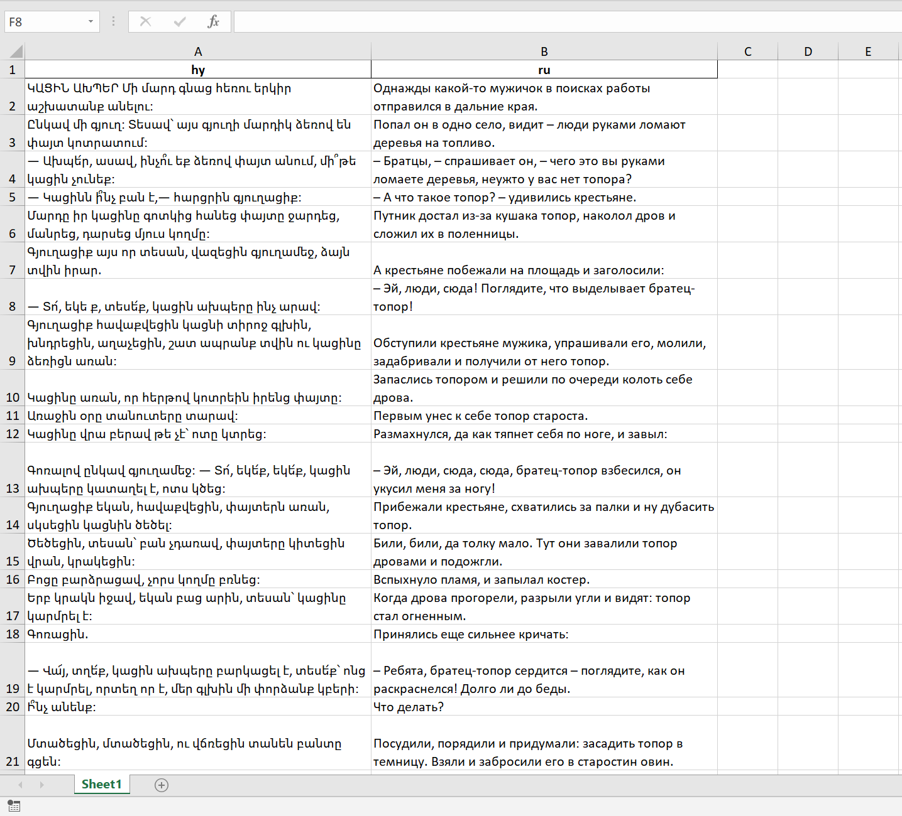

# RNC XML Generator
Библиотека для генерации XML с разметкой.

# Цель библиотеки
Эта библиотека предназначена для оборачивания выровненных текстов, в данном случае на восточноармянском и русском, в XML в формате, поддерживаемом НКРЯ.

С помощью нашего форка библиотеки [razdel](https://github.com/natasha/razdel) предложения на восточноармянском разбиваются на токены, а с помощью [uniparser_eastern_armenian](https://bitbucket.org/timarkh/uniparser-grammar-eastern-armenian/src/master/analyzer/UniParser/) эти токены размечаются морфологическими тегами, добавляется перевод и транслитерация. Предложения на русском остаются при этом "сырыми" и добавляются в XML без изменений.

Обработку можно запускать из терминала. Достаточно запустить из папки проекта (структура описана ниже) команду:
```shell
python main.py --hye hy --rus ru
```
Здесь значение после `--hye` соответствует названию столбца с предложениями на восточноармянском, после `--rus` – на русском в обрабатываемой таблице с выровненными текстами. Другие аргументы не предусмотрены.

После запуска скрипт итеративно обработает каждый файл в папке `input` (опять же, структура проекта описана ниже) и в результате генерируются XML файлы и мета-файл со статистикой, где для каждого текста будет указано количество предложений и количество слов на восточноармянском и русском языках.  

Чтобы воспользоваться библиотекой необходимо:

1) иметь выровненные тексты в формате XLSX, как на скрине ниже



2) положить эти тексты в папку `texts\input`. Структура проекта при этом следующая:
```
YOUR_PROJECT
|_texts
|    |_input # сюда класть выровненные XLSX
|    |_output # здесь появятся XML и мета-файл после обработки
|
|_main.py
|_classes.py
|_eanc2rnc_tag_converter.py
|_hy_translit.py
```

3) скачать наш форк библиотеки `razdel`, которая адаптирована под армянскую пунктуацию. Это можно сделать командой
`pip install git+https://github.com/RNC-Armenian-parallel-corpus/razdel_armenian.git`

Когда требования, перечисленные выше, выполнены, можно запускать программу из командной строки (пример команды см. в начале раздела).
